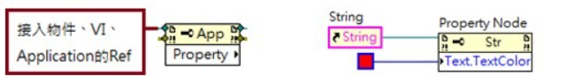
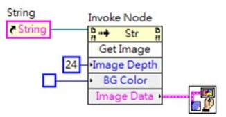
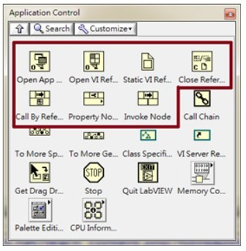
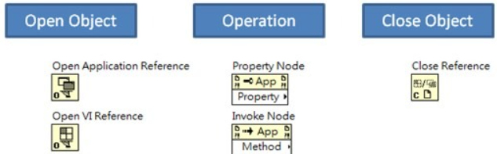
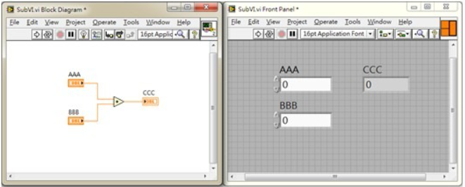
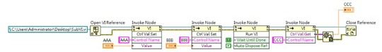
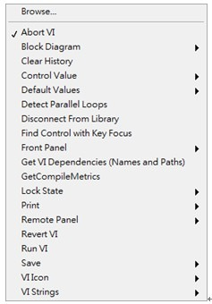

### 台灣就業通 -> 在職訓練網 (https://ojt.wda.gov.tw/)

### Labview 筆記/許濬麟老師 (https://labviewnote.blogspot.com/)

***


***
轉自 LabVIEW Pro (已關站)

## VI Server 基礎介紹

作者 : 蔣步勤

	相信對已經在使用 LabVIEW 的人來說，多少都會聽過 VI Server 這個名詞，到底甚麼是 VI Server 呢？簡單來說 VI Server 是控制 VI 的一種方式，LabVIEW 是一個物件導向的程式語言，所以可以將 VI 看做是一個物件 (Object)，透過屬性 (Property) 與方法 (Method) 來控制 VI，實際上在 LabVIEW 中就是可以透過Property Node 與 Invoke Node 來做控制。先回顧一下何謂 Property Node 與Invoke Node 吧，

在 LabVIEW 環境中，物件的屬性可以用 Property Node 控制，例如可以去更改字體的顏色、大小這類型的屬性。


而 Invoke Node 則是可以去讓物件去執行某個動作，例如將物件的 Front Panel圖案轉出成圖片。


在 LabVIEW Function 選單中的 Application Control 中，如下圖所示，即為我們會使用到的 Function。



詳細的使用模式如下圖，第一步是使用 Open VI Reference 或是 Open Application Reference 來開啟物件，這邊意味著 VI Server 除了可以控制 VI 之外，也可以控制應用程式 (透過 ActiveX)。第二步可以使用 Property Node 去修改物件的屬性，例如 VI Front Panel 的視窗大小，也可以使用 Invoke Node 去執行某個動作，例如讓某個 VI 開始執行。等到使用完畢後，可以透過 Close Reference 去關閉這個物件的 Reference，釋放掉記憶體位置。


講到這邊我們就來試著跑一個範例，來加深對 VI Server 的感覺，這邊先做一個最基礎的例子，我們將一個原本的 SubVI，改成使用 VI Server 的方式來控制。以下是一個最簡單的 SubVI，他的內容如下：



如果使用一般的 SubVI 的方式來去執行這個 VI，我們只要遵守 Data Flow 的程式接線方式即可以呼叫這個 SubVI。


但是如果我們使用 VI Server 的方式來執行這個 SubVI，其程式的流程如下：
```
1. 給予路徑透過 Open VI Reference 開啟一個 VI Ref
2. 依序使用 Invoke Node => Control Value => Set 來設定 SubVI 內的接腳值，這邊有一個特色，我們是使用 Control 的 Label 來指定要設定資料到哪一個 Control
3. 透過 Invoke Node=> RunVI 來執行 SubVI
4. 透過 Invoke Node => Control Value => Get 來取得計算完的結果
5. 關閉 VI Ref
```



```
筆者在這邊承認這個範例有糟糕之處，他讓大家以為透過 VI Server 來控制 VI反而讓程式碼變得複雜了，但是相信有部分的人會發現一些細節，在這邊一一解釋這些特色。
1. 透過 Open VI Reference，我們可以採用指定路徑的方式來開啟 VI，因此反過來說，程式不需要在一開始就將 VI Loading 到記憶體中(一般的 Call SubVI 方式)，因此我可以根據我的需求去指定不同路徑的 VI 來執行，這種方式稱為Plug-In 的呼叫。
2. 在 RunVI 的時候，有一個選項是 Wait Until Done，意思是我們可以在這個Node 去等待 VI 執行完畢後才往後走，也可以選擇不等待 VI 執行完畢，就直接往後執行下一個步驟，意思是我們可以利用這個機制，去動態呼叫一些 VI，並且將這些 VI 變成背景程式在電腦中執行。
3. VI Server 的 Property Node 與 Invoke Node 提供了非常多的選項讓我們可以控制 VI，做一些平常做不到的行為，簡單的做一個 List。
```
Invoke Node 基本選項



Property Node 基本選項


這個單元簡介了甚麼事 VI Server，在下一個單元會開始利用 VI Server 來做一些應用，讓我們在乎叫 VI 的時候有更多的彈性去做控制，另外 VI Server 的 Open Application 可以讓我們去透過 ActiveX 去呼叫其他應用程式，來做各種控制，這也是相當好用的手段。

文章日期:2013/04/09
