## Previeously:
If you had update your D-link rotor/switch is in a bricking state. This guide will help you.

All step can reference here: https://openwrt.org/toh/tp-link/re450

---
## Description
Here is my D-Link RE-355 router.

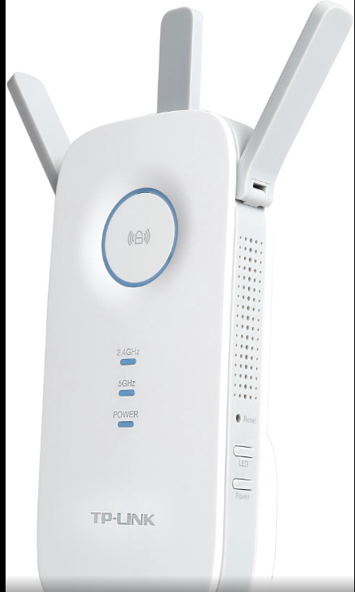

That I tried to replace the original FW.
[Open-WRT:D-link RE-355](<https://openwrt.org/toh/tp-link/re355_v1>)

So I downloaded the Open-WRT firmware from the Open-WRT website.
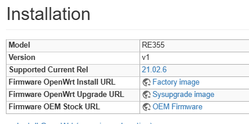

And used the firmware UPGRADE option in the web browser.

Which is follow this step:https://www.tp-link.com/tw/support/faq/1482/
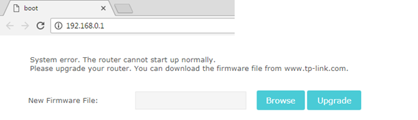

Unfortunately, it is in a bricking state. 
And can't not log-in the website anymore.....


---
## Signature
After i power it on, the LED flashes and goes out, And it repeats this after about five seconds.

Although I tried to use the reset button, but it doesn't work.

---
## Start to debricking

### 1. Find the TLL pad
If you have heard about the TTL, that means you also know the next is open it and soldering some wire to communicate it via usb adapter.

Notice the RE-355 & RE-450 basic with same device, so the TTL pad with the same location.
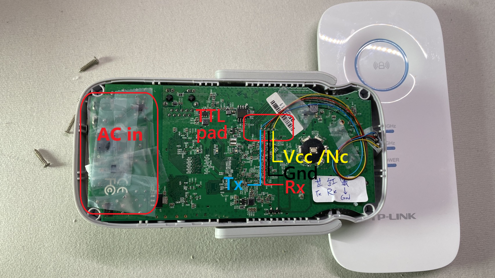
Also you can reference here for the RE450's device in the end of the page. : https://openwrt.org/toh/tp-link/re450

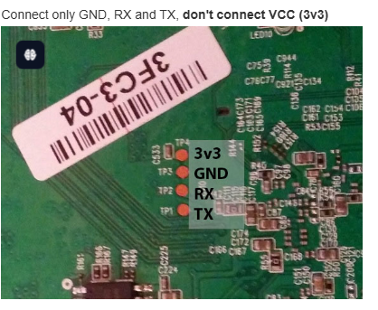


### 2. Soldering the pad
Likely below picture. There are 4 lines connected to it.
But only three wires need to use : Tx,Rx,Gnd.

### 3. Connect to the USB-TTL device
Notice the TTL voltage is 3.3V.
And connect it and open Putty to communicate with it.
Setting your com port and Baud Rate with 115200.

### 4. Check the message then press tpl
If you can see below message, then9 congratulation that you get a U-Boot console successfully.

Notice the message with this line (see below yellow mark), quickly press ***"tpl"*** then the device should not be auto reset util you power off.
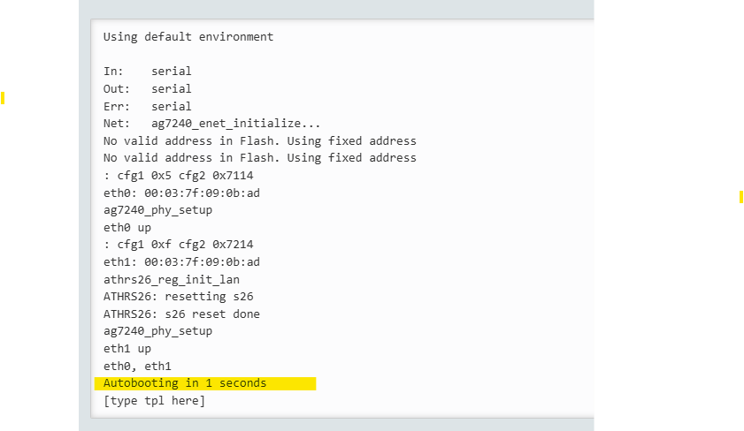

### 5. Setting device's ip address with staic IP
Press bellow code and make sure your ethx device also setting with static IP in 192.168.1.x
https://openwrt.org/toh/tp-link/re450#debricking
```script
hornet> setenv ipaddr 192.168.1.1    <device-ip>
hornet> setenv serverip 192.168.1.3  <server-ip, in your ethx card>
```
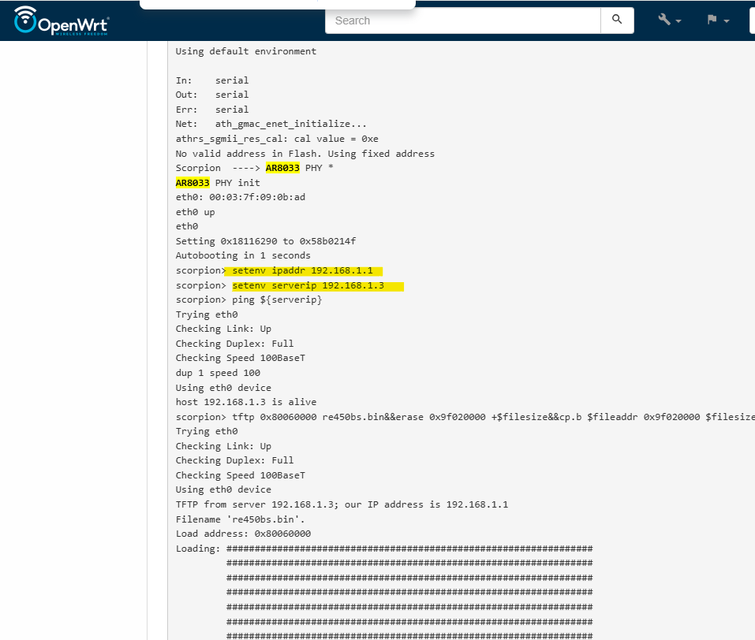

### 6. Setup a tftp server in your PC
Copy the new FW file into the folder same with the tftp software.

tftp solution: https://openwrt.org/toh/tp-link/re355_v1#oem_installation_using_the_tftp_method

re-355 firmware: https://openwrt.org/toh/tp-link/re355_v1#installation

Notice: If your PC have active a Firewall or Virus protect, it may spam this tftp connect. You should temporally disable until this upgrade firmware process finish.
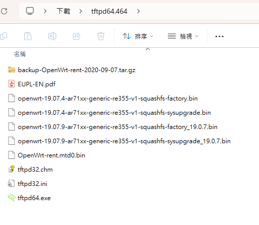
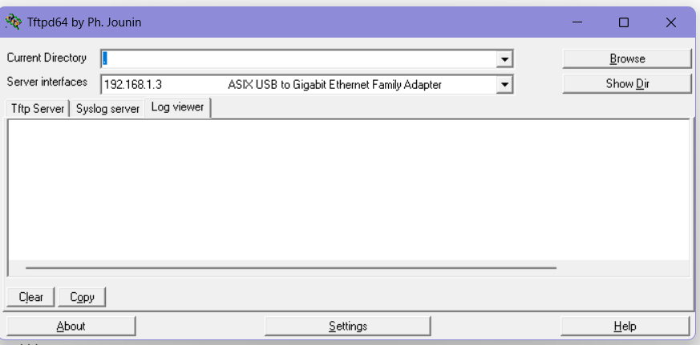

### 7. Start the firmware update process
Follow the official Open-Wrt RT450's De-sticking guide
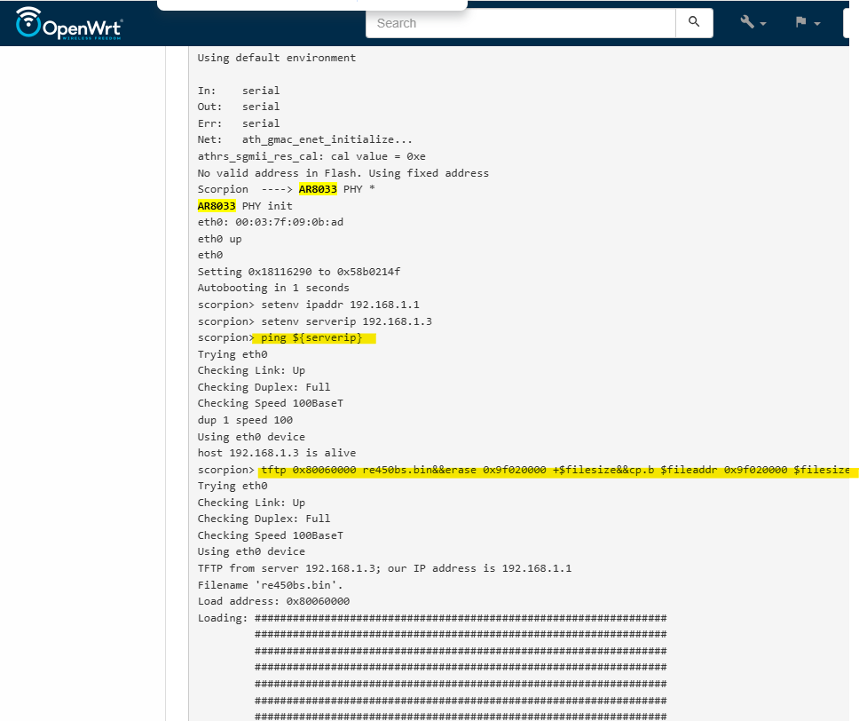


And bellow is the final console what I use.
```console
setenv ipaddr 192.168.1.1

setenv serverip 192.168.1.3

tftp 0x80060000 openwrt-19.07.4-ar71xx-generic-re355-v1-squashfs-sysupgrade.bin&&erase 0x9f020000 +$filesize&&cp.b $fileaddr 0x9f020000 $filesize

boot
```
The file name.
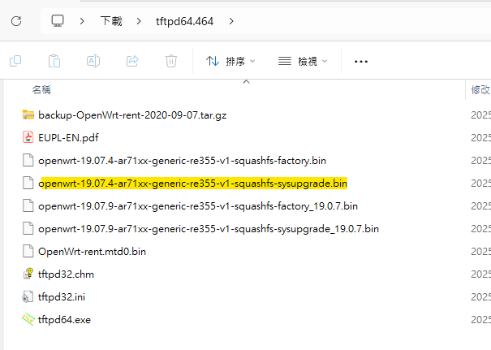


### 8. Share the file what I use
[tftpd64.464+RE3555-.Firmware.7z](<./tftpd64.464+RE3555-.Firmware.7z> "Tilte")


### 9. Reference website

Official Open-Wrt with RE-450.
https://openwrt.org/toh/tp-link/re450


Official Open-Wrt with RE-355 V1.
https://openwrt.org/toh/tp-link/re355_v1


Full Open-Wrt Firmware website in version 19.07.4
https://archive.openwrt.org/releases/19.07.4/targets/ar71xx/generic/

Full Open-Wrt Firmware website TOP folder.
https://archive.openwrt.org/releases/

Open-Wrt Hardware-Firmware mapping table
https://openwrt.org/toh/views/toh_fwdownload?dataflt%5B0%5D=supported%20current%20rel_%3D24.10.0


Old Open-Wrt with tl-mr3020 for reference command.
https://oldwiki.archive.openwrt.org/toh/tp-link/tl-mr3020